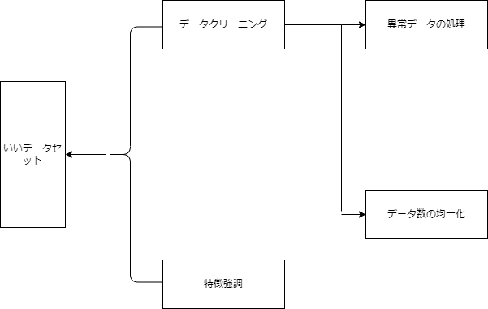
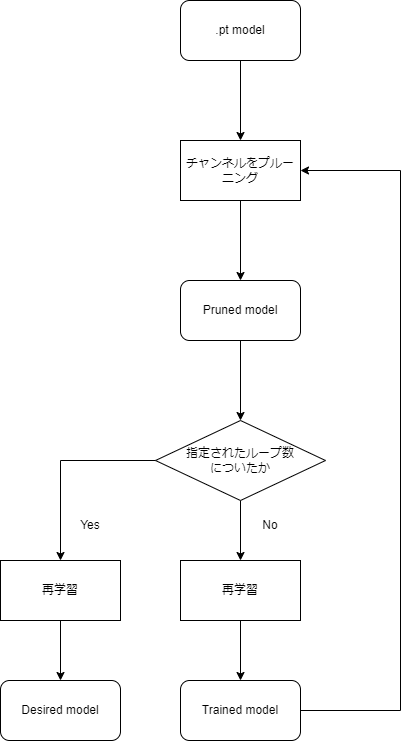
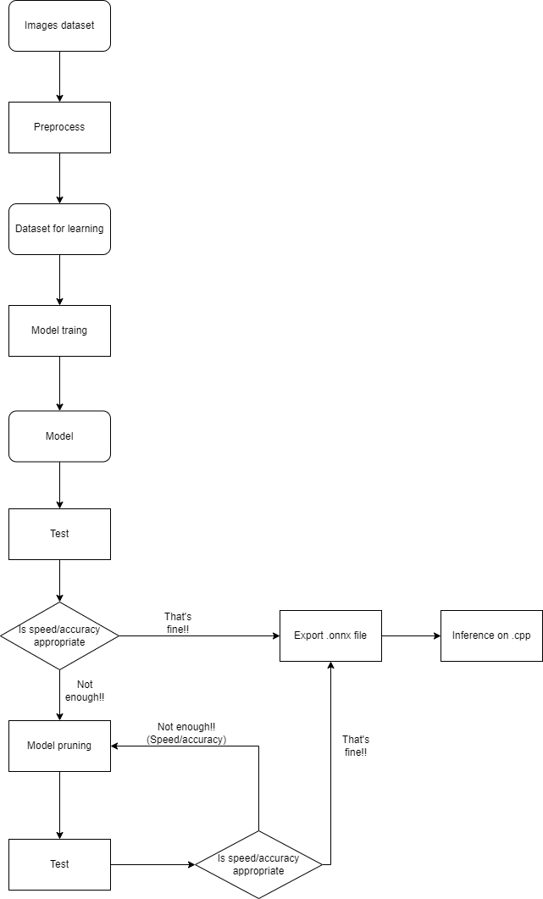

# DLTool Guide Book
## 1. Abstract
This package includes the whole workflow for model training, testing, and generating a general-purpose model (.onnx file) using deep learning techniques.

The goal of this package is to enable the quick reuse of past experiences in current projects. Lowering the barrier to entry for machine learning technologies.

## 2. Install and Configuration
Click [here](installation_en.md) to get installation and configuration.

## 3. Package structure.

We mainly use `tools`，`exps`，`datasets`，`checkpoints` and `Output` these 5 folders.
I will Introduce the contents of each.

**・`tools`**

`tools`'s contenes：

```
tools:.
    default_config.py
    export_onnx.py
    heat_map_torchcam.py
    heat_map.py
    launch.py
    pruning_tool.py
    pruning_train.py
    test.py
    train.py
    utils.py
    __init__.py
    __pycache__
```

・`default_config.py`：Each default configuration for deep learning is included.

・`export_onnx.py`：Source code for converting `.pt` models to `.onnx` models.

・`heat_map_torchcam.py`：Source code for making heat map by `.pt` models.

・`heat_map.py`：Source code for making heat map by `.pt` models.

・`launch.py`：File for executing a customized configuration file.

・`pruning_tool.py`：Source code for pruning a trained `.pt` model.

・`pruning_train.py`：Source code for training when doing the pruning.

・`test.py`：Source code for verifying the probability and speed of the model.

・`train.py`：Source code for training the deep learning model.

・`utils.py`：Source code for tool functions.

**・`exps`**

`exps`'s contents：

```
exps:.
    config_file.py
    onnx_test.py
    prune_config.py
```

`config_file.py`, `onnx_test.py`, and `prune_config.py` are all configuration files created for customization examples.

In order to improve project maintainability, enhance model reproducibility, and enable the reuse of past experiences, it is suggested to have one result model corresponding to one configuration file.


**・`datasets`**

Please put your dataset to `datasets`

**・`checkpoints`**

Please put your result mnodels to `checkpoints`

**・`Output`**

```
Output:.
    checkpoints
```
- `Output/checkpoints`: Please save your terminal models here. ()

>The explanation of the package structure concludes here. The following section will cover the usage instructions and important notes regarding the default configuration files.

## 4. Preparing the dataset.

For making a good dataset, we have to do these things:


**データクリーニング**：
Making a good tring dataset is the most important process of deep learning.

During the data cleaning stage, it is important to include only necessary images in the dataset. This involves preprocessing and handling abnormal data.

Example1：The dataset for classifying cats🐱 and dogs🐶 would look like the following:

```
`train`:
    │
    ├─`cat`: 🐱🐱🐱🐱🐱🐱🐱🐱🐱🐱🐱🐱🐱🐱🐱🐱🐻
    │
    └─`dog`: 🐶🐶🐶🐶🐶🐶🐶🐶🐶🐶🐶🐶🐶🐶🐶🐶🐶
```

As you see, There is 🐻 inside the `cat` class. In this situation, 🐻 is the abnormal data, and we should delete it.

Example2：The dataset for classifying cats🐱 and dogs🐶 would look like the following:

```
`train`:
    │
    ├─`cat`: 🐱🐱🐱
    │
    └─`dog`: 🐶🐶🐶🐶🐶🐶🐶🐶🐶🐶🐶🐶🐶🐶🐶🐶🐶
```

Now we can see, the amount class `cat` is significantly smaller than the amount of class `dog`. If we train model on this dataset, the result might as follows:


**Feature Engineering**：

There are primarily two methods for feature engineering in image processing:

- Noise reduction: Reducing the importance of background or unnecessary parts of data.

- Feature engineering: Increasing the importance of the object to be classified.

>Once the dataset is ready, let's get into the training process!!!!!

## 5. Module architecture and training

### 5.1 Deep learning modules' architecture

This package includes three types of modules: `VGG`, `ResNet` and `EfficientNet`.

Please get the details of moduels' structure from their papers:

`VGG`: 《Very Deep Convolutional Networks for Large-Scale Image Recognition》
        ・arXiv：[1409.1556]

`ResNet`: 《Deep Residual Learning for Image Recognition》
        ・	arXiv:[1512.03385]

`EfficientNet`: 《EfficientNet: Rethinking Model Scaling for Convolutional Neural Networks》
        ・	arXiv:[1905.11946]

**---筆者の一言**

- `VGG`: Following the breaking results of `AlexNet` as the first milestone in `CNN`, `VGG` further improved the accuracy by using smaller `3x3` convolutional kernls and deeper structures. However, as a trade-off, `VGG` also requires more computational resources.

- `ResNet`: `ResNet` is the 'You must know CNN module'. By incorporating the revolutionary concept of `Residual Learning`, `ResNet` achieved higher accuracy than `VGG` with deeper structures and faster forword speed. However, it's important to be cautious of overfitting with deeper strctures, especially when dealing with limited data.

### 5.2 Training model by this package

Let's make a custmize configuration file based on the default configuration.

For example, training a model to classify these tow types animals, each type with 20 images.

| type      |images         |
| ------| --------|
|dog    |🐶🐶🐶🐶🐶🐕🐩🐩🐩🐩🐩🐩🐩🐩🐕‍🦺🐕‍🦺🐕‍🦺🐕‍🦺🐕‍🦺🐕‍🦺|
|cat    |🐱🐱🐱🐱🐱🐱🐱🐱🐱🐱🐱🐱🐱🐱🐱🐈🐈🐈🐈🐈|

- Separating `train`, `val`, `test` datasets

Generralt, it's good to separate datasets to `train` : `val` : `test` = 8 : 1 : 1.
(If you don't have enough `train` data, 9 : 0.5 : 0.5 is acceptable too.)

Following the `train` : `val` : `test` = 8 : 1 : 1 rule, the dataset would be as follows:

```
`train`:
    │
    ├─`dog`: 🐶🐶🐶🐶🐩🐩🐩🐩🐩🐩🐩🐕‍🦺🐕‍🦺🐕‍🦺🐕‍🦺🐕‍🦺
    │
    └─`cat`: 🐱🐱🐱🐱🐱🐱🐱🐱🐱🐱🐱🐱🐱🐈🐈🐈
    It is recommended to ensure that the `train` folder contains every features of each type of classification.
```

```
`val`:
    │
    ├─`dog`: 🐶🐩
    │
    └─`cat`: 🐱🐈
```

```
`test`:
    │
    ├─`dog`: 🐕🐕‍🦺
    │
    └─`cat`: 🐱🐈
    It will be best if the `test` folder contains the images never been seen by `val` or `train`.
```

- Creating a customize configuration file

Requirements
1. The dataset created in the previous step is saved in `dataset/dog_cat/`
2. は Saving model to `Output/dog_cat_checkpoints/` after each epoch training. Save name: `dog_cat_classific`
3. Train the model by `cpu`

Follow requirements, created a customize configration file

`dog_cat_config.py`
```
config = {
    # We are training a model，so put train to True, the others are False.
    'mode': {
        'train': True,
        'test': False,
        'pruning': False
    },

    'train_config': {
        # device
        'device': 'cpu',

        # save mode
        'save_config': {
            'save_per_epoch': True, # Save model after each epoch
            'save_path': 'Output/dog_cat_checkpoints/', # Location for saving models
            'save_name': 'dog_cat_classific_dog_cat_config' # Please add configuration file's file name after your model name.
        },

        # dataset configuration dictionary
        'dataset_config': {
            'train_data_config': {
                'data': 'dataset/dog_cat/train', # train data
            },
            'val_data_config': {
                'data': 'dataset/dog_cat/val', # validation data
            }
        },
    },
}
```

- Training

If you execute the created configuration file `dog_cat_config.py` in `main.py` as shown below, the training will be performed.

`main.py`

```
from tools import launch
from exps import dog_cat_config # Import dog_cat_config.py

config = dog_cat_config.config # Catching configuration dictionary

launch.launch(config) # Run
```

>The training of the model is now complete. For more imformation about the parameters that can be adjusted for training, please refer to the `doc/config_doc_En` document.

## 6. Testing model

### 6.1 Evaluation of `.pt` model

- Requirements

1. Test data is saved in `dataset/dog_cat/`
2. Testing `.pt` model (`checkpoints/test/dog_cat_classific_dog_cat_config1.pt`)
3. Do validation on GPU
4. We want to check the wrong results

It will be recommended to add `test_config` into `dog_cat_config.py`

```
config = {
    # We are doing test，test is True, the others are False
    'mode': {
        'train': False,
        'test': True,
        'pruning': False
    },

    # trian configuration
    'train_config': {
        # device
        'device': 'cpu',

        # save mode
        'save_config': {
            'save_per_epoch': True, # Save model after each epoch
            'save_path': 'Output/dog_cat_checkpoints/', # Location for saving models
            'save_name': 'dog_cat_classific_dog_cat_config' # Please add configuration file's file name after your model name.
        },

        # dataset configuration dictionary
        'dataset_config': {
            'train_data_config': {
                'data': 'dataset/dog_cat/train', # train data
            },
            'val_data_config': {
                'data': 'dataset/dog_cat/val', # validation data
            }
        },
    },

    # Test configuration
    'test_config': {
        'test_mode': {
            'pt_model_test': True,
            'onnx_model_test': False
        },

        # dataset configuration dictionary
        'dataset_config': {
            'data': 'dataset/dog_cat/test',
        },

        # model config
        'model_config': {
            'pretrained_model': 'checkpoints/test/dog_cat_classific_dog_cat_config1.pt'
        },

        'device': 'cuda:0',

        'target': 0,
        'wrong_image_save': True,
        'class_names': ['dog', 'cat']
    },
}
```

### 6.2 Evaluation by `.onnx` model

- Exporting `.onnx` model

Before validating the `.onnx` model, you need to prepare the `.onnx` model.

Run the comment in Powershell or Terminal as follows:

```
python export_onnx_model.py --model {Your model modual} --classes_num {Your dataset's classes number} --pretrained_model {Your .pt model path} --onnx_path {.onnx mdoel path}
```

In our `dog and cat` case:

```
python export_onnx_model.py --model resnet18 --classes_num 2 --pretrained_model checkpoints/test/dog_cat_classific_dog_cat_config1.pt --onnx_path checkpoints/test/dog_cat_classific_dog_cat_config1.onnx
```

- Validation by `.onnx` model

- Requirements

1. Test data is saved in `dataset/dog_cat/
2. Testing `.onnx` model (`checkpoints/test/dog_cat_classific_dog_cat_config1.onnx`)
3. Do validation on CPU
4. We want to check the wrong results

Just do small adjustment on `dog_cat_config.py`:

```
config = {
    # 検証段階なので，testがTrue, 他のはFalse
    'mode': {
        'train': False,
        'test': True,
        'pruning': False
    },

    # trian configuration
    'train_config': {
        # device
        'device': 'cpu',

        # save mode
        'save_config': {
            'save_per_epoch': True, # Save model after each epoch
            'save_path': 'Output/dog_cat_checkpoints/', # Location for saving models
            'save_name': 'dog_cat_classific_dog_cat_config' # Please add configuration file's file name after your model name.
        },

        # dataset configuration dictionary
        'dataset_config': {
            'train_data_config': {
                'data': 'dataset/dog_cat/train', # train data
            },
            'val_data_config': {
                'data': 'dataset/dog_cat/val', # validation data
            }
        },
    },

    # test configuration
    'test_config': {
        'test_mode': {
            'pt_model_test': False,
            'onnx_model_test': True
        },

        # dataset configuration dictionary
        'dataset_config': {
            'data': 'dataset/dog_cat/test',
        },

        # model config
        'model_config': {
            'pretrained_model': 'checkpoints/test/dog_cat_classific_dog_cat_config1.onnx'
        },

        'device': 'cpu',

        'target': 0,
        'wrong_image_save': True,
        'class_names': ['dog', 'cat']
    },
}
```

>The model validation is now complete. Based on the results, you can proceed with either deploying the model in inference, retraining the model or pruning the model.

## 7. Model pruning

- Why model pruning is necessary：
> There are two resons：
> 1. Getting dozens images even less for a specialized feature per month is very common in the industry image inspection field. If you use a deep learning model to fit a small dataset, it will definily be overfitted. This can result in poor generalization and inaccurate predictions. Therefore, to avoid this situation, we use model pruning.
> 2. Generally, a trained deep learning model's volumn will be dozons MB or even more. This can result in wastage of RAM and slower processing speed. Some researchs show that  pruning 60% to 80% fo model's channel can lead to faster speed and more accurate predictions.

- Workflow of pruning

Workflow of pruning is as follows:



- Creating a customize configuration file

Requirments:
1. Dataset is saved in `dataset/dog_cat/`
2. The model we want to prune: `checkpoints/test/dog_cat_classific_dog_cat_config1.pt`
3. Save model to `Output/dog_cat_checkpoints/` every epoch. Save name is `dog_cat_classific_pruned`. (Pruned model's strcture is different with the model before pruned. As a result, we save `.onnx` model directly. )
4. Prune 80% of model's channels with 8 iterations.
5. Target is class `dog` with index `0`.
6. Use GPU to train the model.

`dog_cat_prune_config.py`:
```
config = {
    # We are pruning the model
    'mode': {
        'train': False,
        'test': False,
        'pruning': True
    },

    # pruning configuration dictionary
    'pruning_config': {
        # save configuration dictionary
        'save_config': {
            'save_onnx_per_epoch': True,
            'save_path': 'Output/dog_cat_checkpoints/',
            'save_name': 'dog_cat_classific_pruned',
        },

        # dataset configuration dictionary
        'dataset_config': {
            'train_data_config': {
                'data': 'dataset/dog_cat//train',
            },
            'val_data_config': {
                'data': 'dataset/dog_cat//val',
            }
        },

        # model config
        'model_config': {
            'pretrained_model': 'checkpoints/test/dog_cat_classific_dog_cat_config1.pt'
        },

        # Hyperparameters configuration dictionary
        'Hyperparams_config': {
            'target': 0,
        },

        # pruner configration dictionary
        'pruner_config': {
            'iterative_steps': 8,
            'channel_sparsity': 0.8,
        },

        'device': 'cuda:0',
    }
}
```

For details, please check keys and values in `doc/config_doc_en.md`.

>Here is the complete content of this package. Thank you very much for reading it carefully. If you have encounter any bugs or have any adjustments you would like to suggest, please submit an issue. Thank you very much again!!


## 8. Check heatmap on GUI

We can check the heatmap on GUI now! 

You just need to select `Heatmap Viewer` in `Mode`, and select fill the configuration items in the `Heatmap Viewer`, the press the `Run` button. There will be a `Heatmap Viewer` window pops up and you can check every heatmap of each image in the folder you just selected.


## 9. Workflow
In general, our workflow as follows:

