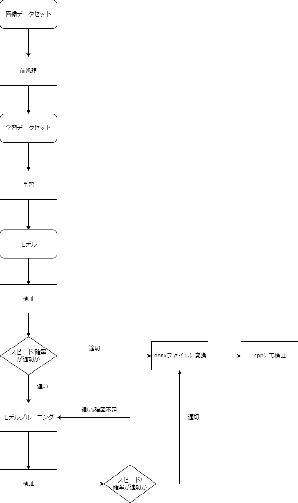

# DLTool Guide Book
## 1. 概要
本パッケージでは，深層学習モデルの学習・検証・通用モデル(.onnxフャイル)及びモデルプルーニング一連のワークフローが含まれたパッケージである.
本パッケージで達成したい目標：過去の経験を現在のプロジェクトに素早く流用できること.

## 2. インストールと配置
[ここ](installation.md)をクリックしてパッケージなどをインストールしてください。

## 3. パッケージ構造

主に使うフォルダは`tools`，`exps`，`datasets`，`checkpoints`及び`Output`5つのフォルダである.
それぞれの中身を紹介する：

**・`tools`**

`tools`の中身は以下のようになる：

```
tools:.
    default_config.py
    export_onnx.py
    heat_map_torchcam.py
    heat_map.py
    launch.py
    pruning_tool.py
    pruning_train.py
    test.py
    train.py
    utils.py
    __init__.py
    __pycache__
```

・`default_config.py`：深層学習についての各デフォルト配置を入れてある.

・`export_onnx.py`：`.pt`モデルを`.onnx`モデルに変換するためのソースコード.

・`heat_map_torchcam.py`: `.pt`モデルによるheat mapを作るソースコード.

・`heat_map.py`: `.pt`モデルによるheat mapを作るソースコード.

・`launch.py`：カスタマイズしたコンフィグフャイルを実行するためのフャイル.

・`pruning_tool.py`：学習できた`.pt`モデルをプルーニングするためのソースコード.

・`pruning_train.py`：プルーニングする時で学習するためのソースコード

・`test.py`：モデルの確率・スピードを検証するためのソースコード.

・`train.py`：学習するためのソースコード.

・`utils.py`：工具のソースコード.

**・`exps`**

`exps`の中身は以下のようになる：

```
exps:.
    config_file.py
    onnx_test.py
    prune_config.py
```

`config_file.py`, `onnx_test.py`及び`prune_config.py`は全部カスタマイズ使用例のために作ったコンフィグフャイルである.

プロジェクトの保守性向上・学習モデルの再現性向上及び過去の経験を流用できることを目指すため，
一個の結果モデルを一個コンフィグフャイルに対応してください.

**・`datasets`**

`datasets`に学習用のデータセットをいれてください.

**・`checkpoints`**

`checkpoints`に結果モデルを入れてください.

**・`Output`**

```
Output:.
    checkpoints
```
・`Output/checkpoints`：学習・プルーニングする時に一時保存するモデルの保存場所.(コンフィグフャイルで保存場所を変換できるので，このフォルダは確定ではない)


>ここまでに本パッケージの構造説明が終わる.以下ではデフォルトコンフィグフャイルによる使用方法と注意事項になる.

## 4. データセットの準備

いいデータセットを作るために，以下のようの手段がある.


**データクリーニング**：
いい教師データを作る最初の最も重要の工程はデータクリーニングである.

データクリーニング段階では，いる画像だけをデータセットに入れることは大事.つまり異常データ処理：

例1：猫🐱と犬🐶を分類するデータセットは以下のようになる：

```
`train`:
    │
    ├─`cat`: 🐱🐱🐱🐱🐱🐱🐱🐱🐱🐱🐱🐱🐱🐱🐱🐱🐻
    │
    └─`dog`: 🐶🐶🐶🐶🐶🐶🐶🐶🐶🐶🐶🐶🐶🐶🐶🐶🐶
```

見えるように，`cat`類の中では🐻が入ってしまう.その状況では，🐻が異常データと見られて，デリートすべき

例1：猫🐱と犬🐶を分類するデータセットは以下のようになる：

```
`train`:
    │
    ├─`cat`: 🐱🐱🐱
    │
    └─`dog`: 🐶🐶🐶🐶🐶🐶🐶🐶🐶🐶🐶🐶🐶🐶🐶🐶🐶
```

見えるように，`cat`類の数が極めて`dog`類の数より小さい.このデータセットで作ったモデルでは，以下のような結果を出す可能性が高い.


**特徴強調**：

画像処理技術の特徴強調には主に２つの手段がある：

・ノイズを無くす：分類したいもの以外の背景や要らない部分の重要度を低減すること

・特徴を強調する：分類したいものを背景より重要度を高めること

>データセットを準備出来たら，早速学習になります.

## 5. モジュールの構造と学習

### 5.1 深層学習モジュールの構造

本パッケージでは，`VGG`, `ResNet`及び`EfficientNet`3つのモジュールを入れ込んだ.

モジュールの詳しい構造では論文で確認してください.

`VGG`: 《Very Deep Convolutional Networks for Large-Scale Image Recognition》
        ・arXiv：[1409.1556]

`ResNet`: 《Deep Residual Learning for Image Recognition》
        ・	arXiv:[1512.03385]

`EfficientNet`: 《EfficientNet: Rethinking Model Scaling for Convolutional Neural Networks》
        ・	arXiv:[1905.11946]

**---筆者の一言**

・`VGG`：`AlexNet`は初めて`CNN`で里程碑的な結果をまらった直ぐに，`VGG`がより小さい`3x3`の
コンボリューションカーネルとより深い構造でこの確率を更に高めた. だが，その代わりに，より多い計算資源が`VGG`で取られる

・`ResNet`：”分からないいかないCNNモジュール”と言われている. 革新的に`Residual Learning`を入れ込み，`VGG`より深い構造とより速い処理スピードでより高い確率を出した. 深い構造はつまり過学習になりやすいため，データ量が少ないと要注意

・`EfficientNet`：固定されたスケーリング係数でモジュールの深さ，幅及び解像度を均一で調整する構造.

### 5.2 本パッケージで学習モデルを作る

これからデフォルトコンフィグによるカスタマイズコンフィグフャイルの作成に進めていきたい.

例えば以下のような2種類の動物各20枚画像を分類するモデルを作りたい．

| 種類      |画像         |
| ------| --------|
|dog    |🐶🐶🐶🐶🐶🐕🐩🐩🐩🐩🐩🐩🐩🐩🐕‍🦺🐕‍🦺🐕‍🦺🐕‍🦺🐕‍🦺🐕‍🦺|
|cat    |🐱🐱🐱🐱🐱🐱🐱🐱🐱🐱🐱🐱🐱🐱🐱🐈🐈🐈🐈🐈|

- `train`, `val`, `test`のフォルダ分け

`train` : `val` : `test`数比は8 : 1 : 1 のは普段の配置．(`train`数が足りない場合だと9 : 0.5 : 0.5 でもある．)

8 : 1 : 1 のは普段の配置を遵守し，`train`, `val`, `test`のフォルダ分けは以下のようになる：

```
`train`:
    │
    ├─`dog`: 🐶🐶🐶🐶🐩🐩🐩🐩🐩🐩🐩🐕‍🦺🐕‍🦺🐕‍🦺🐕‍🦺🐕‍🦺
    │
    └─`cat`: 🐱🐱🐱🐱🐱🐱🐱🐱🐱🐱🐱🐱🐱🐈🐈🐈
    `train`フォルダの中に，分類したい各種類の画像の特徴が全部含まれるようにすることがお勧め．
```

```
`val`:
    │
    ├─`dog`: 🐶🐩
    │
    └─`cat`: 🐱🐈
    `train`フォルダの全部かいくつかの特徴があれば良い.
```

```
`test`:
    │
    ├─`dog`: 🐕🐕‍🦺
    │
    └─`cat`: 🐱🐈
    `val`か`train`の中で出たことがない画像が一番いい. (アルゴリズムには見せたことない)
```

- コンフィグフャイルの作成

学習仕様:
1. 前のステップで作ったデータセットを`dataset/dog_cat/`に保存してある．
2. 毎回の学習モデルを保存したい．保存場所は`Output/dog_cat_checkpoints/`，モデルネームは`dog_cat_classific`
3. GPUがないので，CPUで学習したい．

コンフィグフャイルには以下のようになる：

`dog_cat_config.py`
```
config = {
    # 学習段階なので，trainがTrue, 他のはFalse
    'mode': {
        'train': True,
        'test': False,
        'pruning': False
    },

    'train_config': {
        # device
        'device': 'cpu',

        # save mode
        'save_config': {
            'save_per_epoch': True, # モデルを毎回保存
            'save_path': 'Output/dog_cat_checkpoints/', # モデルの保存場所
            'save_name': 'dog_cat_classific_dog_cat_config' # モデルネームの後ろにコンフィグフャイルを追加のはお勧め
        },

        # dataset configuration dictionary
        'dataset_config': {
            'train_data_config': {
                'data': 'dataset/dog_cat/train', # 教師データ
            },
            'val_data_config': {
                'data': 'dataset/dog_cat/val', # バリデーションデータ
            }
        },
    },
}
```

- 学習

作ったコンフィグフャイル`dog_cat_config.py`を`main.py`で以下のように実行すれば，学習が行われる

`main.py`

```
from tools import launch
from exps import dog_cat_config # dog_cat_configをインポートする

config = dog_cat_config.config # config辞典を抽出する

launch.launch(config) # 実行
```

>以上モデルの学習が終わる．学習に関する各調整できるパラメータを`doc/config_doc`にて参照してください.

## 6. モデルの評価

モデルの学習が終わった後に，評価工程に入る．

### 6.1 `.pt`モデルの検証

- テスト仕様

1. テスト用のデータセットを`dataset/dog_cat/`に保存してある．
2. `.pt`モデルを評価する(`checkpoints/test/dog_cat_classific_dog_cat_config1.pt`)
3. GPUで検証する
4. 間違った結果も見てみたい


`dog_cat_config.py`の中に`test_config`を追加すれば良い：

```
config = {
    # 検証段階なので，testがTrue, 他のはFalse
    'mode': {
        'train': False,
        'test': True,
        'pruning': False
    },

    # 学習配置
    'train_config': {
        # device
        'device': 'cpu',

        # save mode
        'save_config': {
            'save_per_epoch': True, # モデルを毎回保存
            'save_path': 'Output/dog_cat_checkpoints/', # モデルの保存場所
            'save_name': 'dog_cat_classific_dog_cat_config' # モデルネームの後ろにコンフィグフャイルを追加のはお勧め
        },

        # dataset configuration dictionary
        'dataset_config': {
            'train_data_config': {
                'data': 'dataset/dog_cat/train', # 教師データ
            },
            'val_data_config': {
                'data': 'dataset/dog_cat/val', # バリデーションデータ
            }
        },
    },

    # テスト配置
    'test_config': {
        'test_mode': {
            'pt_model_test': True,
            'onnx_model_test': False
        },

        # dataset configuration dictionary
        'dataset_config': {
            'data': 'dataset/dog_cat/test',
        },

        # model config
        'model_config': {
            'pretrained_model': 'checkpoints/test/dog_cat_classific_dog_cat_config1.pt'
        },

        'device': 'cuda:0',

        'target': 0,
        'wrong_image_save': True,
        'class_names': ['dog', 'cat']
    },
}
```

### 6.2 `.onnx`モデルの検証

- `.onnx`モデルの作成

`.onnx`モデルを検証する前に，`.onnx`モデルを用意する

下記のコメントをターミナルに入力し，実行してください.

```
python export_onnx_model.py --model {Your model modual} --classes_num {Your dataset's classes number} --pretrained_model {Your .pt model path} --onnx_path {.onnx mdoel path}
```

前の犬と猫を分類する例：

```
python export_onnx_model.py --model resnet18 --classes_num 2 --pretrained_model checkpoints/test/dog_cat_classific_dog_cat_config1.pt --onnx_path checkpoints/test/dog_cat_classific_dog_cat_config1.onnx
```

- `.onnx`モデルの検証

- テスト仕様

1. テスト用のデータセットを`dataset/dog_cat/`に保存してある．
2. `.pt`モデルを評価する(`checkpoints/test/dog_cat_classific_dog_cat_config1.onnx`)
3. CPUで検証する
4. 間違った結果も見てみたい

`dog_cat_config.py`を少し調整すれば良い：

```
config = {
    # 検証段階なので，testがTrue, 他のはFalse
    'mode': {
        'train': False,
        'test': True,
        'pruning': False
    },

    # 学習配置
    'train_config': {
        # device
        'device': 'cpu',

        # save mode
        'save_config': {
            'save_per_epoch': True, # モデルを毎回保存
            'save_path': 'Output/dog_cat_checkpoints/', # モデルの保存場所
            'save_name': 'dog_cat_classific_dog_cat_config' # モデルネームの後ろにコンフィグフャイルを追加のはお勧め
        },

        # dataset configuration dictionary
        'dataset_config': {
            'train_data_config': {
                'data': 'dataset/dog_cat/train', # 教師データ
            },
            'val_data_config': {
                'data': 'dataset/dog_cat/val', # バリデーションデータ
            }
        },
    },

    # テスト配置
    'test_config': {
        'test_mode': {
            'pt_model_test': False,
            'onnx_model_test': True
        },

        # dataset configuration dictionary
        'dataset_config': {
            'data': 'dataset/dog_cat/test',
        },

        # model config
        'model_config': {
            'pretrained_model': 'checkpoints/test/dog_cat_classific_dog_cat_config1.onnx'
        },

        'device': 'cpu',

        'target': 0,
        'wrong_image_save': True,
        'class_names': ['dog', 'cat']
    },
}
```

>ここまでにモデルの検証が終わる．結果による実際運用か再学習かプルーニングするに進む．

## 7. モデルプルーニング

- なぜモデルプルーニングをするか：
> 理由は２つである：
> 1. 画像検査の世界に，特定な特徴かキズが一か月間何回も出ることがないのもあるので，データは極めて不足することはよくある．そのなん百枚の画像で学習できたモデルでは，現在であるデータに対応する限りだ．つまり汎用性は低い．汎用性を高めるために，モデルの一定なチャンネルを切ることになる．
> 2. 通常学習できたモデルは何十MB・何百MBにするので，工程上では使い道が狭い．研究から見ると，モデルを60%~80%のチャンネルを切ることによるスピード・確率を高めることができる．その方法で出来たモデルでは，実用化ができることになる．

- プルーニングのワークフロー

プルーニングのワークフローは以下のようになる：


- コンフィグフャイルの作成

学習仕様:
1. 前のステップで作ったデータセットを`dataset/dog_cat/`に保存してある．
2. 目標プルーニング`.pt`モデルの保存場所：`checkpoints/test/dog_cat_classific_dog_cat_config1.pt`
3. 毎回の学習モデルを保存したい．保存場所は`Output/dog_cat_checkpoints/`，モデルネームは`dog_cat_classific_pruned`(プルーニングしたモデルの構造と元の構造とは違うので，再学習不能となる．直接`.onnx`モデルを保存する．)
4. 8回のプルーニングで元のモデルの80%のチャネルを切りたい．
5. 目標クラスはインデックスが`0`である`dog`．
6. GPUで学習する．

`dog_cat_prune_config.py`:
```
config = {
    'mode': {
        'train': False,
        'test': False,
        'pruning': True
    },

    # pruning configuration dictionary
    'pruning_config': {
        # save configuration dictionary
        'save_config': {
            'save_onnx_per_epoch': True,
            'save_path': 'Output/dog_cat_checkpoints/',
            'save_name': 'dog_cat_classific_pruned',
        },

        # dataset configuration dictionary
        'dataset_config': {
            'train_data_config': {
                'data': 'dataset/dog_cat//train',
            },
            'val_data_config': {
                'data': 'dataset/dog_cat//val',
            }
        },

        # model config
        'model_config': {
            'pretrained_model': 'checkpoints/test/dog_cat_classific_dog_cat_config1.pt'
        },

        # Hyperparameters configuration dictionary
        'Hyperparams_config': {
            'target': 0,
        },

        # pruner configration dictionary
        'pruner_config': {
            'iterative_steps': 8,
            'channel_sparsity': 0.8,
        },

        'device': 'cuda:0',
    }
}
```

各キーワードと対応するバリューを`doc/config_doc.md`にて参照してください.

>ここまで本パッケージの全部内容である．きちんと読んで頂いて，誠にありがとうございます. 使用する間に`BUG`または調整させて欲しい所があれは，`ISSUE`にて記入してください.

## 8. 使用例
基本流れは以下のようになる：

