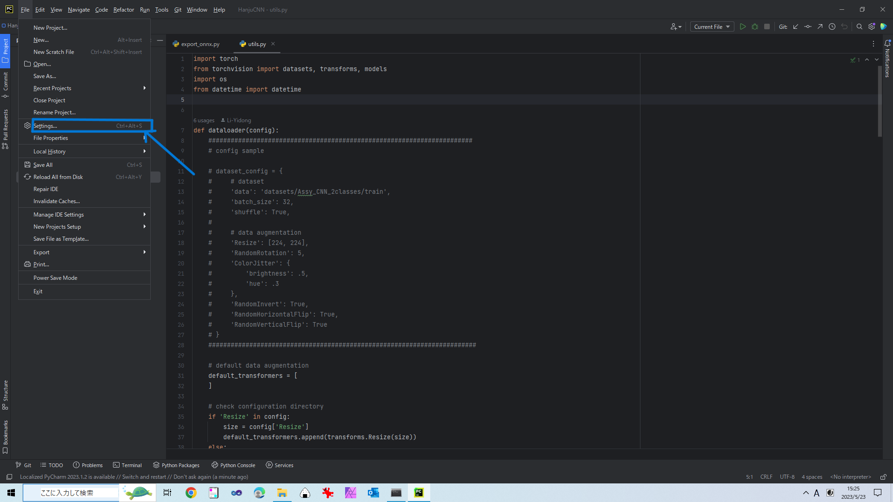
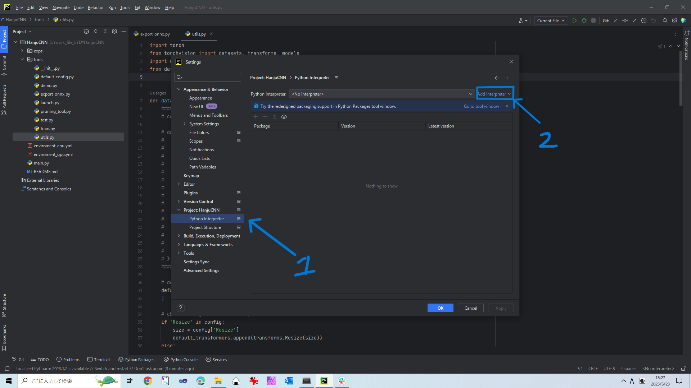
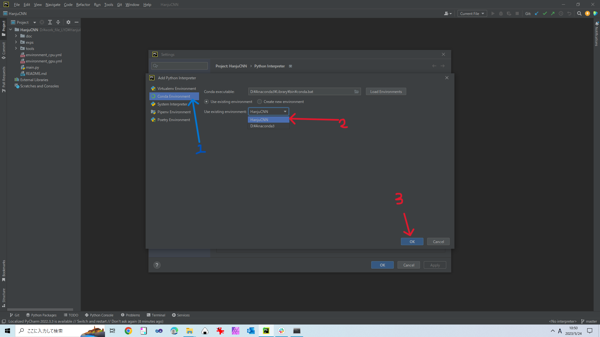
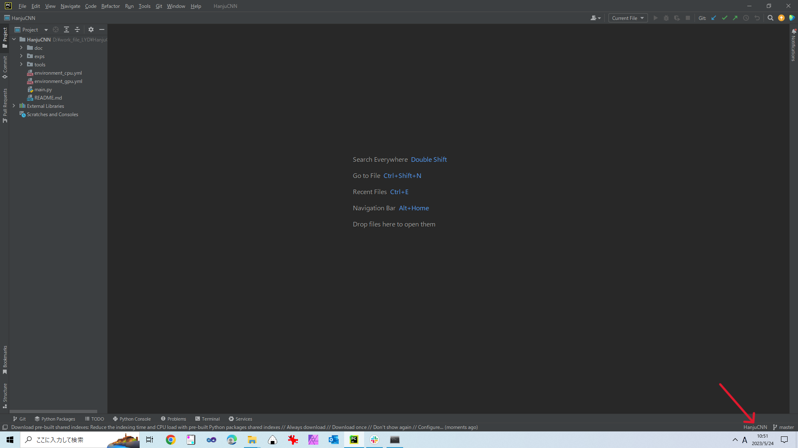

## インストールと配置
本パッケージではanacondaとpycharmの併用を推奨する
### 1 anacondaの配置
#### ・Linux(Ubuntu)
[ここ](https://qiita.com/yamagarsan/items/d9864fd01f3f4cca2938)にて参照し，Ubuntuバージョンanacondaをインストールしてください.
#### ・Windows
[ここ](https://www.kkaneko.jp/tools/win/anacondainst.html)にて参照し，Windowsバージョンanacondaをインストールしてください.

### 2 Parcharm
#### ・Linux(Ubuntu)
[ここ](https://qiita.com/m0p1nt/items/3c4cb0796f09fce0b591)にて参照し，UbuntuバージョンParcharmをインストールしてください.
#### ・Windows
[ここ](https://sukkiri.jp/technologies/ides/pycharm/pycharm-win.html)にて参照し，WindowsバージョンParcharmをインストールしてください.

### 3 本パッケージ
以下のコメントをコメント欄で実行してください.
`https://github.com/Li-Yidong/DLTool.git`
>注意：ライトアクセスを持っている前提としてgit cloneできたプロジェクトの内容を変換すると，
mainではなく，新しいブランチにて編集してください.

### 4 conda環境構築

以下のコメントを順次実行実行してください.

conda環境を作る：
`conda create --name DLTool python=3.9`

新しい環境をアクティブする：
`conda activate DLTool`

**Pytorch**
・[ここ](https://pytorch.org/)を参照して自分の環境と合うパッケージをインストールしてください。

**onnx**
・Linux(ubuntu)/Windows
GPU/CPU: `conda install -c conda-forge onnx`

**onnx_runtime**
・Linux(ubuntu)/Windows
GPU/CPU: `conda install -c conda-forge onnxruntime`

**matplotlib**
・Linux(ubuntu)/Windows
GPU/CPU: `conda install -c conda-forge matplotlib`

**pillow**
・Linux(ubuntu)/Windows
GPU/CPU: `conda install -c anaconda pillow`

**torch-pruning**
・Linux(ubuntu)/Windows
GPU/CPU: `pip install torch-pruning`

**torchcam**
`conda install -c conda-forge torchcam`

**python-dotenv**
・Linux(ubuntu)/Windows
`pip install python-dotenv`

**PyQt6**
・Linux(ubuntu)/Windows
`pip install PyQt6`

**tqdm**
・Linux(ubuntu)/Windows
`pip install tqdm`

### 5 Pycharmにconda環境の導入
**DLTool**フォルダをPycharmで開き，以下の手順でconda環境をPycharmプロジェクトに導入

・step1: プロジェクト画面左上の`File`をクリックし，`Settings...`をクリック


・step2: `Project: DLTool`の中の`Python Intepreter`をクリックし，`Add Intepreter`をクリック


・step3: 出てきた画面に`Conda Environment`クリックし，右画面の`Use existing environmont`にある`DLTool`環境を選択して右下の`OK`をクリック


・step4: 最後にプロジェクト画面右下の`DLTool`を確認してください.


### 6 必要フォルダの作成

本パッケージをインストールした時点の構造は以下となります。

```
DLTool:.
│  main.py
|  main_gui.py
|  .env.example
|  .gitignore
|  config.ini
│  README.md
|  README_en.md
│
├─app
|
├─CPP_Inference
│
├─doc
│
├─exps
│
├─json
|
└─tools
```

Github倉庫容量リミットのために，データセットと学習モデルをアップロードしていなかった。
以下のようにフォルダ/ファイルを追加してください.
追加するファイル：.env
追加するフォルダ：datasets, checkpoints, Output, Output/checkpoints

```
DLTool:.
│  main.py
|  main_gui.py
|  .env
|  .env.example
|  .gitignore
|  config.ini
│  README.md
|  README_en.md
│
├─app
|
├─CPP_Inference
│
├─doc
|
├─datasets
│
├─checkpoints
│
├─Output
│  │
│  └─checkpoints
│
├─exps
│
├─json
|
└─tools
```

### 7 環境パスの設置
GUIを起動する前に、環境パスを設置しないといけない。.env.exampleの中身を.envにコピーしてください。
以下のように環境パスを変更してください。
`PATH_UI`: `./json/ui.json`
`PATH_UI_ABS`: `{Your_Path_To_DLTool}/DLTool/json/ui.json`
`PATH_CFG`: `./config.ini`
`PATH_CFG_ABS`: `{Your_Path_To_DLTool}/DLTool/config.ini`


>ここまでに環境構築が終わる. GOOD JOB!!!!!!!!!