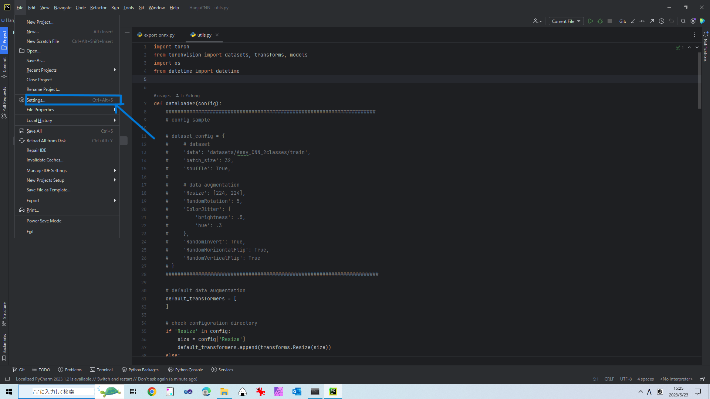
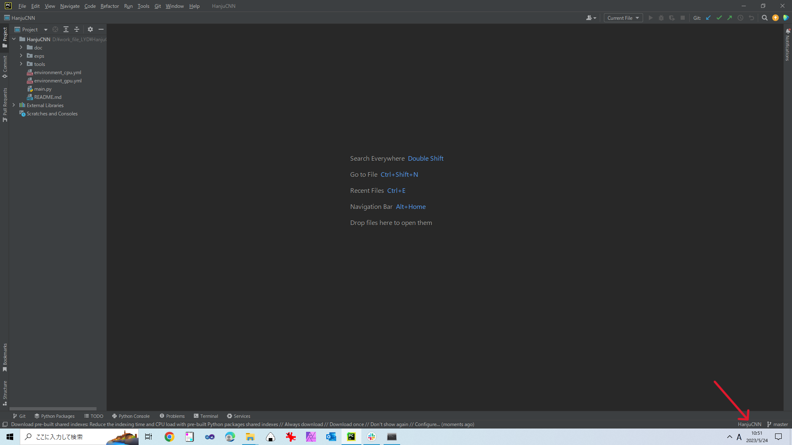

## Install and Configuration

We suggest using PyCharm to edit files and Anaconda to build a virtual environment.

### 1 Anaconda installation
#### ・Linux(Ubuntu)
Click [here](https://docs.anaconda.com/free/anaconda/install/linux/) to install Anaconda.

#### ・Windows
Click [here](https://docs.anaconda.com/free/anaconda/install/windows/) to install Anaconda.

### 2 Parcharm Community Edition
#### ・Linux(Ubuntu)
Click [here](https://www.jetbrains.com/help/pycharm/installation-guide.html#bd1730d1) to install Parcharm Community Edition.

#### ・Windows
Click [here](https://www.jetbrains.com/help/pycharm/installation-guide.html#bd1730d1) to install Parcharm Community Edition.

### 3 This Package
Run this command in PowerShell or Terminal.
`https://github.com/Li-Yidong/DLTool.git`

>tips：If you have the write access, you should edit your code on a new branch.

### 4 Build conda virtual environment

Create conda environment:
`conda create --name DLTool python=3.9`

Activate the environment you just created:
`conda activate DLTool`

**Pytorch**
・Click [here](https://pytorch.org/) and select your os and compute platform for installation

**onnx**
・Linux(ubuntu)/Windows
GPU/CPU: `conda install -c conda-forge onnx`

**onnx_runtime**
・Linux(ubuntu)/Windows
GPU/CPU: `conda install -c conda-forge onnxruntime`

**matplotlib**
・Linux(ubuntu)/Windows
GPU/CPU: `conda install -c conda-forge matplotlib`

**pillow**
・Linux(ubuntu)/Windows
GPU/CPU: `conda install -c anaconda pillow`

**torch-pruning**
・Linux(ubuntu)/Windows
GPU/CPU: `pip install torch-pruning`

**torchcam**
`conda install -c conda-forge torchcam`

**python-dotenv**
・Linux(ubuntu)/Windows
`pip install python-dotenv`

**PyQt6**
・Linux(ubuntu)/Windows
`pip install PyQt6`

**tqdm**
・Linux(ubuntu)/Windows
`pip install tqdm`

### 5 Setting up a conda environment in PyCharm.
Open the `DLTool` folder in PyCharm and follow the steps below to set up a conda environment for the PyCharm project.

・step1: Click on `File` at the top left of the project screen, and then click on `Settings...`.


・step2: Click on `Python Intepreter` which at the left，click on `Add Intepreter`.


・step3: Choose `Conda Environment`，click in `Use existing environmont`, then choose the `DLTool`. After that, click `OK` button.


・step4: Finally, please verify `DLTool` at the bottom right of the project screen.


### 6 Creating necessary folders.

If you install this package, you will get this structure:

```
DLTool:.
│  main.py
|  main_gui.py
|  .env.example
|  .gitignore
|  config.ini
│  README.md
|  README_en.md
│
├─app
|
├─CPP_Inference
│
├─doc
│
├─exps
│
├─json
|
└─tools
```

Due to the storage limit of the GitHub repository, We did not upload the dataset and the training model. Please add the create these folders/files.
File：.env
Folders：datasets, checkpoints, Output, Output/checkpoints

```
DLTool:.
│  main.py
|  main_gui.py
|  .env
|  .env.example
|  .gitignore
|  config.ini
│  README.md
|  README_en.md
│
├─app
|
├─CPP_Inference
│
├─doc
|
├─datasets
│
├─checkpoints
│
├─Output
│  │
│  └─checkpoints
│
├─exps
│
├─json
|
└─tools
```

### 7 Set enviroment path
Before run the GUI, we need to set some enviroment path. 
1. Copy all codes of .env.example to .env
2. Change enviroment path as bellow: 
    `PATH_UI`: `./json/ui.json`
    `PATH_UI_ABS`: `{Your_Path_To_DLTool}/DLTool/json/ui.json`
    `PATH_CFG`: `./config.ini`
    `PATH_CFG_ABS`: `{Your_Path_To_DLTool}/DLTool/config.ini`

>Here you completed your environment!! GOOD JOB!!!!!!!!!